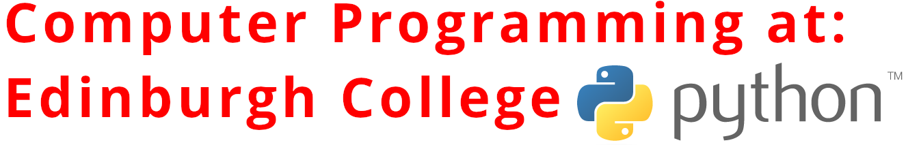

# computer-programing

## Computer Programming Class Repo

### Module Outline Page

This page is designed to suport the Computer Programming Class at Edinburgh College, this covers the following course codes:

  - JOHA34 Computer Programming
  - H17334 Software Development Introduction
  - HY2C45 Computer Programming
  - EC146020/21
  - EC000190/009

# Course Outline HNC/HND

  - I will populate this as the course is written, topics may change as the course progresses

| Week | Date | Topic | Lab |
| ------ | ------ | ------ | ------ |
| 1 |07 Sep 2020 | Introduction & Overview | Installing Python 3 |
| 2 |14 Sep 2020 | Types of Language 2 Imperative & Declarative Knowledge | Creating simple algorithms | 
| 3 |21 Sep 2020 | Flowcharts & Pseudocode | Creating Flowcharts to represent algorithms |
| 4 |28 Sep 2020 | Testing & Debugging | Representing algorithms in pseudocode and flowcharts |
| 5 |05 Oct 2020 | Syntax & Semantics | Fixing Prints |
| 6 |12 Oct 2020 | Variables & Types | Variables & Types |
| 7 |19 Oct 2020 | October Break | |
| 8 |26 Oct 2020 | Conditionals & String Indexing | Conditionals & String Indexing |


### Software Required

# Getting Python
Getting the latest version of python, at the time of writing this was 3.8.5 but 3.6 will be released soon - from here: https://www.python.org/downloads/

```sh
$ python3.8.5
$ print ("hello World")
```
# Online Flowchart / Diagram Creator
Copies of visio are available from azure - however I think that this website makes life a lot easier: https://app.diagrams.net/
 
 I have not tested things out yet but you can install the desktop version from here https://github.com/jgraph/drawio-desktop/releases/tag/v13.7.3

